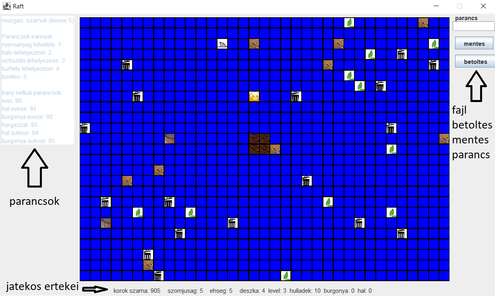

## Raft

A jatekost a command rublikaba megadott szamkombinaciokkal lehet iranyitani, es kulonbozo cselekveseket vegrehajtatni vele.
~~~~
A parancsok ugy épulnek fel hogy a mozgatas 1-9-ig
(1:balle , 2:le, 3:jobble, 4:bal, 6:jobb, 7:balfel, 8:fel, 9:jobbfel)
~~~~
A **felvesz** utasitasok **1** szammal kezdodnek es utana az iranyt kell megadni ami ugyanaz mint a mozgatasba (pl:16:a jatekostol jobbra talalhato dolgot veszi fel)

**Halot** **2** kezdetu szamokkal lehet lehelyezni iranyat a felveszhez hasonloan lehet meghatarozni.

**Viztisztizotott**  a **3**as kezdetu szamokal lehet lehelyezni ugyanazzal az iranymegadassal mint eddig.

**Tuzhelyet** a **4**es kezdetu szamokkal lehet lehelyezni ugyannazal az iranymegadassal mint a tobbit.

**Hajot boviteni** **5**os kezdetu szamokkal lehet ugyannazal az iranymegadassal mint a tobbit.

### Tovabbi parancsok
~~~~
Ivas:90

Halateszik:91

Burgonyateszik:92

Horgaszik:93

Halatsut:94

Burgonyatsut:95.
~~~~

#### Sutni, enni, vizet inni ugy lehet ha rajt allsz a tuzhelyen vagy a viztisztiton!!!!

### A Termekek arai: 
~~~~
Halo: 2*deszka + 6*level

Viztisztito: 2*level + 4*hulladek

Tuzhely: 2*deszka + 4*level + 3*hulladek

Teruletbovites: 2*deszka + 2*level.
~~~~

A tuzhely sehol nem irja ki hogy hogy all az epp felrakot burgony igy azt erdemes lehet szamolni a viztisztito szinten nem irja ki
, mindketto 25 cselekves allat vegez a feladataval tehat keszit egy pohar vizet es suti keszre az etelt.

A JavaDoc- bol legeneralt HTML fajlt a docs mappaban index.html alatt talalni
